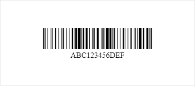

# PHP Code 128 Encoder for Barcode Font

Encode text for use with Code 128 fonts such as [Libre Barcode 128](https://github.com/graphicore/librebarcode). The actual encoding is done by [tc-lib-barcode](https://github.com/tecnickcom/tc-lib-barcode).

## Installation

Install PHP Code 128 Encoder using [Composer](https://getcomposer.org/):

```
composer require hbgl/php-code-128-encoder
```

## Usage

```php
<?php

require __DIR__ . '/../vendor/autoload.php';

use Hbgl\Barcode\Code128Encoder;

// Encode as Code 128.
$encoded = Code128Encoder::encode('ABC123456DEF');
assert ($encoded === 'ÌABCÇ,BXÈDEFqÎ');

// Only encode using Type A.
$encodedA = Code128Encoder::encode('ABC123456DEF', 'A');
assert ($encodedA === 'ËABC123456DEFLÎ');

// Only encode using Type B.
$encodedB = Code128Encoder::encode('AcC123456DeF', 'B');
assert ($encodedB === 'ÌAcC123456DeFSÎ');

// Only encode using Type C.
$encodedC = Code128Encoder::encode('123456', 'C');
assert ($encodedC === 'Í,BXLÎ');
```

Use it together with the [Libre Barcode 128](https://github.com/graphicore/librebarcode) font to show a barcode on a webpage:

```php
<?php

require __DIR__ . '/../vendor/autoload.php';

use Hbgl\Barcode\Code128Encoder;

$content = 'ABC123456DEF';
$encoded = Code128Encoder::encode($content);

?>
<!DOCTYPE html>
<html>
    <head>
        <meta charset="utf-8">
        <meta name="viewport" content="width=device-width, initial-scale=1, shrink-to-fit=no">
        <title>Code 128</title>
        <link href="https://fonts.googleapis.com/css?family=Libre+Barcode+128&display=swap" rel="stylesheet">
        <style>
            body {
                text-align: center;
            }
            .code128 {
                padding: 3rem 1.5rem 0 1.5rem;
                font-family: "Libre Barcode 128";
                font-size: 3rem;
                transform: scaleY(1.5);
            }
        </style>
    </head>
    <body>
        <div class="code128"><?= htmlspecialchars($encoded) ?></div>
        <div><?= htmlspecialchars($content) ?></div>
    </body>
</html>
```

Result:



## License

This library is licensed under the [MIT license](https://opensource.org/licenses/MIT).